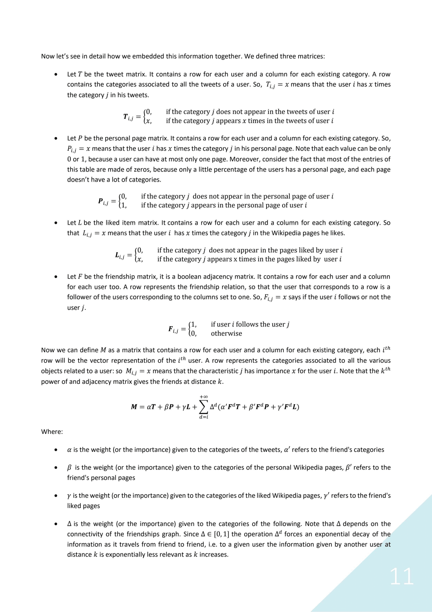

# Web and Social Information Extraction
In this work we're mainly dealing with the [WikiMID](http://wikimid.tweets.di.uniroma1.it/wikimid/) dataset.

We have been able to represent each Twitter user and each Wikipedia page in terms of their semantic categories, taken from [BabelNet](https://babelnet.org/) (disambiguating the text with [Babelfy](http://babelfy.org/index) when necessary).

The approach used to build the recommender system is very general: it makes possible to recommend, obtaining a score, whichever item that can be expressed in terms of BabelNet categories, without any further training (e.g. any page of Wikipedia or any synset in BabelNet that has categories associated), possibly without directly knowing the user preferences.

The key idea is the method used to represent the objects in terms of semantic categories:

## Notes about efficiency
We are dealing with big matrices. The adjacency matrix has dimension 500𝑘×500𝑘, even if it’s a boolean matrix, storing it entirely in memory would mean to require 58GB of RAM (assuming no overhead). The situation is even worse when we consider the other matrices that have dimension 500𝑘×190𝑘, each one of them would require 353GB of RAM (assuming no overhead) since they contain float32 and not booleans.
It’s obvious that it is not feasible to store in memory those dense matrices. Fortunately, we can exploit one common property: they are sparse matrices.
We used SciPy. Sparse to work with these matrices, and we were able to fit them, and the computations, in a 32GB machine.
However, using this approach lead to some limitations: not all the functions made available by sklearn accept a sparse matrix, and not all the functions scale well enough memory wise. So, our choices  ere limited by the available options.
One of the main motivations that lead us to continue the project in python and not in java, was that java hasn’t a good enough, easy to use, library to handle sparse matrices, algebraic computations and machine learning tools. Instead in python we could leverage SciPy, NumPy and sklearn that, together, met all our needs.

##### Adjacency matrix exponentiation
Must be noted, as already explained, that performing the 𝑖-power of the adjacency matrix gives us the nodes at distance 𝑖. Given the structure of the graph that one could expect from twitter users (some people have a lot of edges, following the Zipf law) it is straightforward to see that the initially sparse adjacency matrix would become exponentially less sparse at each exponentiation. On our 32GB machine we were able to compute only the square of the adjacency matrix.
Probably the operations could be optimized in some way, but we think that the importance of information decreases exponentially as it travels from friend to friend, and we enforced this behaviour setting an exponential decay in the formula. So, what we computed should give us a good enough approximation of an optimal computation (where higher powers of the adjacency matrix are computed).

## Recommender system
A glimpse of the item-based with mean-distances recommender performances.
Our goal was to give a ranking to six possible recommendations, given for some users. Lower distance means better match.
Note that the distances computed _do not_ depend only on the users preferences.

| Preferences: <kbd>user 1057516135</kbd>        | Possible recommendations                 | Distance |
| ---------------------------------------------- | ---------------------------------------- | -------- |
| <kbd>WIKI:EN:Funko</kbd>                       | <kbd>WIKI:EN:Red_Hot_Chili_Peppers</kbd> | 0.62     |
| <kbd>WIKI:EN:Overwatch</kbd>                   | <kbd>WIKI:EN:The_Beatles</kbd>           | 0.63     |
| <kbd>WIKI:EN:Simon's_Cat</kbd>                 | <kbd>WIKI:EN:Kenny_Wayne_Shepherd</kbd>  | 0.88     |
| <kbd>WIKI:EN:Muy_Interesante</kbd>             | <kbd>WIKI:EN:Susie_Cagle</kbd>           | 0.90     |
| <kbd>WIKI:EN:Amazon.com</kbd>                  | <kbd>WIKI:EN:Sean_St_Ledger</kbd>        | 1.95     |
| <kbd>WIKI:EN:Alex_Hirsch</kbd>                 | <kbd>WIKI:EN:Boyce_Avenue</kbd>          | 1.03     |
| <kbd>WIKI:EN:Jack_Flash</kbd>                  |                                          |          |
| <kbd>WIKI:EN:Son_of_God</kbd>                  |                                          |          |
| <kbd>WIKI:EN:EMP_Merchandising</kbd>           |                                          |          |
| <kbd>WIKI:EN:AC/DC</kbd>                       |                                          |          |
| <kbd>WIKI:EN:ZZ_Top</kbd>                      |                                          |          |
| <kbd>WIKI:EN:Lynyrd_Skynyrd</kbd>              |                                          |          |
| <kbd>WIKI:EN:Led_Zeppelin</kbd>                |                                          |          |
| <kbd>WIKI:EN:The_Who</kbd>                     |                                          |          |
| <kbd>WIKI:EN:The_Doors</kbd>                   |                                          |          |
| <kbd>WIKI:EN:Tony_Iommi</kbd>                  |                                          |          |
| <kbd>WIKI:EN:Led_Zeppelin</kbd>                |                                          |          |
| <kbd>WIKI:EN:Pink_Floyd</kbd>                  |                                          |          |
| <kbd>WIKI:EN:Five_Finger_Death_Punch_   </kbd> |                                          |          |
| <kbd>WIKI:EN:Intimissimi</kbd>                 |                                          |          |
| <kbd>WIKI:EN:Iron_Maiden</kbd>                 |                                          |          |
| <kbd>WIKI:EN:Ozzy_Osbourne</kbd>               |                                          |          |
| <kbd>WIKI:EN:Blizzard_Entertainment_    </kbd> |                                          |          |
| <kbd>WIKI:EN:Metallica</kbd>                   |                                          |          |
| <kbd>WIKI:EN:Steven_Tyler</kbd>                |                                          |          |
| <kbd>WIKI:EN:The_Rolling_Stoneskbd>            |                                          |          |
| <kbd>WIKI:EN:Aerosmith</kbd>                   |                                          |          |

| Preferences: <kbd>user 101935414</kbd> | Possible recommendations            | Distance |
| -------------------------------------- | ----------------------------------- | -------- |
| <kbd>WIKI:EN:Rinko_Kikuchi</kbd>       | <kbd>WIKI:EN:Shinichi_Osawa</kbd>   | 0.55     |
| <kbd>WIKI:EN:Maria_Sharapova</kbd>     | <kbd>WIKI:EN:Gilles_Peterson</kbd>  | 0.55     |
| <kbd>WIKI:EN:Yoshitomo_Nara</kbd>      | <kbd>WIKI:EN:Peter_Barakan</kbd>    | 0.56     |
| <kbd>WIKI:EN:Daoko</kbd>               | <kbd>WIKI:EN:Kyle_Lohse</kbd>       | 0.57     |
| <kbd>WIKI:EN:Jamie</kbd>               | <kbd>WIKI:EN:Bonnie_Bernstein</kbd> | 0.64     |
| <kbd>WIKI:EN:Nina_Kraviz</kbd>         | <kbd>WIKI:EN:Kevin_Davies</kbd>     | 0.80     |
| <kbd>WIKI:EN:Teru</kbd>                |
| <kbd>WIKI:EN:Richie</kbd>              |
| <kbd>WIKI:EN:Instagram</kbd>           |
| <kbd>WIKI:EN:Lady_Gaga</kbd>           |
| <kbd>WIKI:EN:Koji_Uehara</kbd>         |
| <kbd>WIKI:EN:SoundCloud</kbd>          |
| <kbd>WIKI:EN:4hero</kbd>               |
| <kbd>WIKI:EN:Allyson_Felix</kbd>       |
| <kbd>WIKI:EN:Mixcloud</kbd>            |
| <kbd>WIKI:EN:Mixlr</kbd>               |
| <kbd>WIKI:EN:Gackt</kbd>               |
| <kbd>WIKI:EN:The_Japan_Times</kbd>     |
| <kbd>WIKI:EN:YouTube</kbd>             |
| <kbd>WIKI:EN:Naoko_Yamazaki</kbd>      |
| <kbd>WIKI:EN:Ji-hae</kbd>              |
| <kbd>WIKI:EN:Ninja_Tune</kbd>          |
| <kbd>WIKI:EN:Yukihiro_Takahashi</kbd>  |
| <kbd>WIKI:EN:Mirai_Nagasu</kbd>        |
| <kbd>WIKI:EN:Zeebra</kbd>              |
| <kbd>WIKI:EN:David_Lynch</kbd>         |

| Preferences: <kbd>user 101532373</kbd>  | Possible recommendations                 | Distance |
| --------------------------------------- | ---------------------------------------- | -------- |
| <kbd>WIKI:EN:President_of_Italy</kbd>   | <kbd>WIKI:EN:Francesco_Facchinetti</kbd> | 0.49     |
| <kbd>WIKI:EN:Mental_Floss</kbd>         | <kbd>WIKI:EN:Vanessa_Mesquita</kbd>      | 0.51     |
| <kbd>WIKI:EN:Siae</kbd>                 | <kbd>WIKI:EN:Michael_Franti</kbd>        | 0.61     |
| <kbd>WIKI:EN:RTL_102.5</kbd>            | <kbd>WIKI:EN:Julie_Gonzalo</kbd>         | 0.71     |
| <kbd>WIKI:EN:Alessandra_Amoroso</kbd>   | <kbd>WIKI:EN:LCD_Soundsystem</kbd>       | 0.87     |
| <kbd>WIKI:EN:Francesca_Michielin</kbd>  | <kbd>WIKI:EN:Michelin_Guide</kbd>        | 0.91     |
| <kbd>WIKI:EN:Brooklyn_Bowl</kbd>        |                                          |          |
| <kbd>WIKI:EN:Danilo_Petrucci</kbd>      |                                          |          |
| <kbd>WIKI:EN:Simona_Ventura</kbd>       |                                          |          |
| <kbd>WIKI:EN:Francesca_Archibugi</kbd>  |                                          |          |
| <kbd>WIKI:EN:Daniel_Ek</kbd>            |                                          |          |
| <kbd>WIKI:EN:Adnkronos</kbd>            |                                          |          |
| <kbd>WIKI:EN:Emma_Marrone</kbd>         |                                          |          |
| <kbd>WIKI:EN:Luca_Argentero</kbd>       |                                          |          |
| <kbd>WIKI:EN:Pierfrancesco_Favino</kbd> |                                          |          |
| <kbd>WIKI:EN:Fabio_De_Luigi</kbd>       |                                          |          |
| <kbd>WIKI:EN:Federica_Pellegrini</kbd>  |                                          |          |
| <kbd>WIKI:EN:Fabio_Aru</kbd>            |                                          |          |
| <kbd>WIKI:EN:Vincenzo_Nibali</kbd>      |                                          |          |
| <kbd>WIKI:EN:Sky_TG24</kbd>             |                                          |          |
| <kbd>WIKI:EN:TgCom24</kbd>              |                                          |          |
| <kbd>WIKI:EN:Andrea_Ranocchia</kbd>     |                                          |          |
| <kbd>WIKI:EN:Nicola_Formichetti</kbd>   |                                          |          |
| <kbd>WIKI:EN:Upworthy</kbd>             |                                          |          |
| <kbd>WIKI:EN:BuzzFeed</kbd>             |                                          |          |
| <kbd>WIKI:EN:Giulio_Base</kbd>          |                                          |          |
| <kbd>WIKI:EN:Stephan_Moccio</kbd>       |                                          |          |
| <kbd>WIKI:EN:Stromae</kbd>              |                                          |          |
| <kbd>WIKI:EN:Napster</kbd>              |                                          |          |
| <kbd>WIKI:EN:Marco_Werman</kbd>         |                                          |          |
| <kbd>WIKI:EN:Luca_Parmitano</kbd>       |                                          |          |
| <kbd>WIKI:EN:Joe_Bastianich</kbd>       |                                          |          |
| <kbd>WIKI:EN:John_Lurie</kbd>           |                                          |          |
| <kbd>WIKI:EN:RAI1</kbd>                 |                                          |          |
| ...                                     |

| Preferences: <kbd>user 104239528</kbd>                           | Possible recommendations           | Distance |
| ---------------------------------------------------------------- | ---------------------------------- | -------- |
| <kbd>WIKI:EN:Paola_Turci</kbd>                                   | <kbd>WIKI:EN:Luciano_Ligabue</kbd> | 0.47     |
| <kbd>WIKI:EN:Tiziano_Ferro</kbd>                                 | <kbd>WIKI:EN:Sabina_Guzzanti</kbd> | 0.49     |
| <kbd>WIKI:EN:Massive_Attack</kbd>                                | <kbd>WIKI:EN:Ivan_Basso</kbd>      | 0.49     |
| <kbd>WIKI:EN:Giles_Duley</kbd>                                   | <kbd>WIKI:EN:Peter_Diamandis</kbd> | 0.50     |
| <kbd>WIKI:EN:Sheryl_Sandberg</kbd>                               | <kbd>WIKI:EN:Jonathan_Meeks</kbd>  | 0.55     |
| <kbd>WIKI:EN:Mark_Zuckerberg</kbd>                               | <kbd>WIKI:EN:Lovato</kbd>          | 0.99     |
| <kbd>WIKI:EN:Benji</kbd>                                         |
| <kbd>WIKI:EN:Federica_Pellegrini</kbd>                           |
| <kbd>WIKI:EN:Tania_Cagnotto</kbd>                                |
| <kbd>WIKI:EN:Kent_Moran</kbd>                                    |
| <kbd>WIKI:EN:Ben_Affleck</kbd>                                   |
| <kbd>WIKI:EN:Rosario_Dawson</kbd>                                |
| <kbd>WIKI:EN:The_Intercept</kbd>                                 |
| <kbd>WIKI:EN:Jeremy_Scahill</kbd>                                |
| <kbd>WIKI:EN:Glenn_Greenwald</kbd>                               |
| <kbd>WIKI:EN:CBS_News</kbd>                                      |
| <kbd>WIKI:EN:Sky_News</kbd>                                      |
| <kbd>WIKI:EN:Al_Jazeera_English</kbd>                            |
| <kbd>WIKI:EN:NBC_News</kbd>                                      |
| <kbd>WIKI:EN:The_Wall_Street_Journal</kbd>                       |
| <kbd>WIKI:EN:CNN</kbd>                                           |
| <kbd>WIKI:EN:World_Food_Programme</kbd>                          |
| <kbd>WIKI:EN:United_Nations_High_Commissioner_for_Refugees</kbd> |
| <kbd>WIKI:EN:Amnesty_International</kbd>                         |
| <kbd>WIKI:EN:Human_Rights_Watch</kbd>                            |
| <kbd>WIKI:EN:Reuters</kbd>                                       |
| <kbd>WIKI:EN:WikiLeaks</kbd>                                     |
| <kbd>WIKI:EN:Sadiq_Khan</kbd>                                    |
| <kbd>WIKI:EN:Subsonica</kbd>                                     |
| <kbd>WIKI:EN:Pope_Francis</kbd>                                  |
| <kbd>WIKI:EN:Edward_Snowden</kbd>                                |
| <kbd>WIKI:EN:Mark_Ruffalo</kbd>                                  |
| <kbd>WIKI:EN:Donna_Moderna</kbd>                                 |
| ...                                                              |

___

More information in the full [report](https://github.com/LucaMoschella/WSIEProject/blob/master/report/tosend/WSIE_project_report_moschella_spini.pdf).
