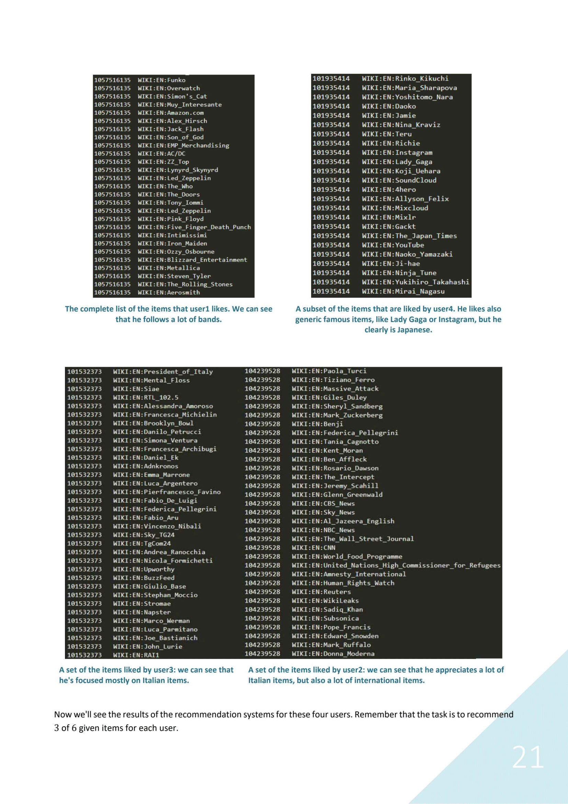
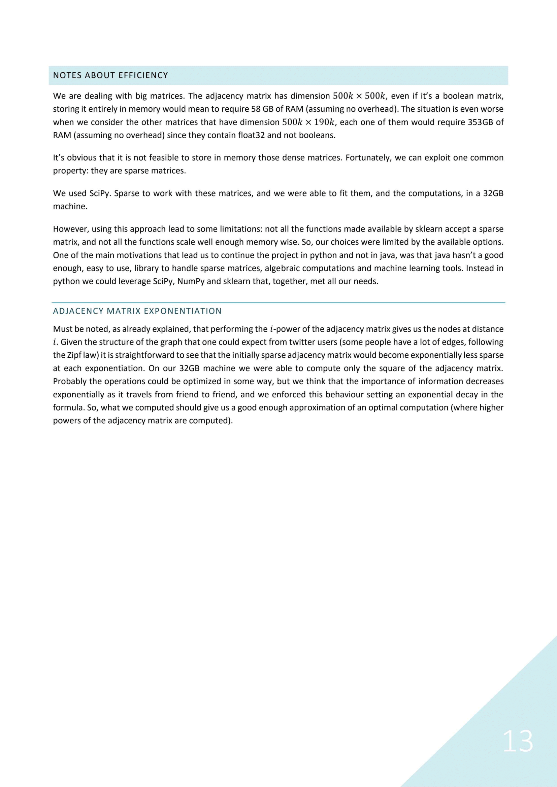

# Web and Social Information Extraction
In this work we're mainly dealing with the [WikiMID](http://wikimid.tweets.di.uniroma1.it/wikimid/) dataset.

We have been able to represent each Twitter user and each Wikipedia page in terms of their semantic categories, taken from BabelNet.

The approach used to build the recommender system is very general: it makes possible to recommend, obtaining a score, whichever item that can be expressed in terms of BabelNet categories, without any further training (e.g. any page of Wikipedia or any synset in BabelNet that has categories associated), possibly without directly knowing the user preferences.

The key idea is the method used to represent the objects in term of semantic categories:

A glimpse of the recommender performances:

More information in the [report](https://github.com/LucaMoschella/WSIEProject/blob/master/report/tosend/WSIE_project_report_moschella_spini.pdf).
